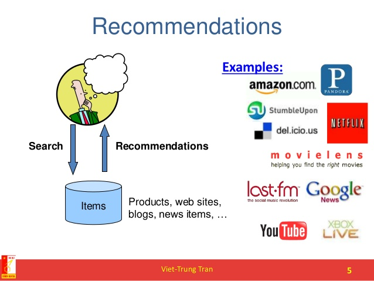
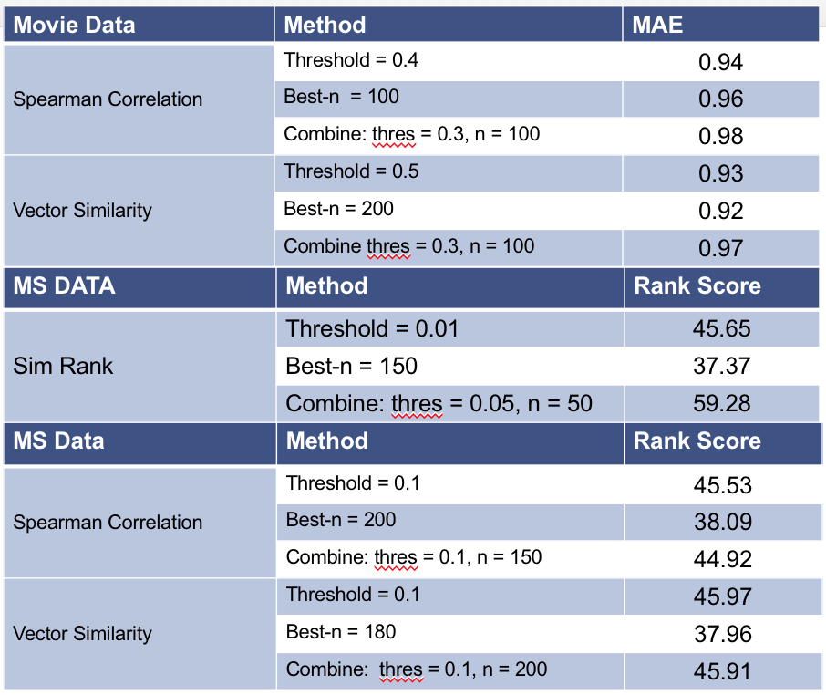
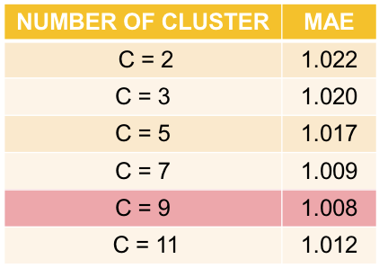

# Collaborative Filtering



Term: Spring 2018

+ Projec title: Algorithm implementation and evaluation
+ Team members
	+ Jiang, Yiran
	+ Wan, Qianhui
	+ Xue, Zhongxing
	+ Lam, Leo
	+ Zhu, Qianli

	
+ About the Project: Collaborative filtering refers to the process of making automatic predictions (filtering) about the interests of a user by collecting preferences or taste information from many users (collaborating). In this project, our team has applied memory-based algorithm and model-based algorithm working on the Microsoft Web Dataset and EachMovie Dataset. In the memory-based algorithm, we used Spearman correlation, Vector similarity and SimRank to calculate the similarity weight; weight threshold, best-n-estimator and combined in selecting neighbours. In the model-based algorithm, we applied cluster models. 
+ For the cluter models, we split train data to 90% train dataset and 10% validation set. We randomly select 700 initial parameter vector and run EM algorithm to find MLE with C++ code. The result was accurate and efficent(with test MAE1.007, with less than 2 hours).

+ Following are result analysis of different combinations of memory-based algorithm and model-based algorithm: 
+ 
+ 
	
	
	
**Contribution statement**: ([default](doc/a_note_on_contributions.md)) All team members contributed equally in all stages of this project. All team members approve our work presented in this GitHub repository including this contributions statement. 

- Lam, Leo: Neighbours selecting on Weight Threshold, Best-n-estimator and combined on Microsoft Web data. Ranked score evaluation. prediction function.

- Xue,zhongxing: Implementation of cluster models, optimization of cluster model parameters.

- Jiang, yiran: SimRank, Spearman Similarity, Vector Similarity, main.Rmd

- Wan, Qianhui: Similarity Weight on Spearman Similarity, Vector Similarity, MAE evaluation, Github organization

- Zhu, Qianli: Neighbours selecting on Weight Threshold, Best-n-estimator and combined on EachMovie data. Prediction  function


Following [suggestions](http://nicercode.github.io/blog/2013-04-05-projects/) by [RICH FITZJOHN](http://nicercode.github.io/about/#Team) (@richfitz). This folder is orgarnized as follows.

```
proj/
├── lib/
├── data/
├── doc/
├── figs/
└── output/
```

Please see each subfolder for a README file.
